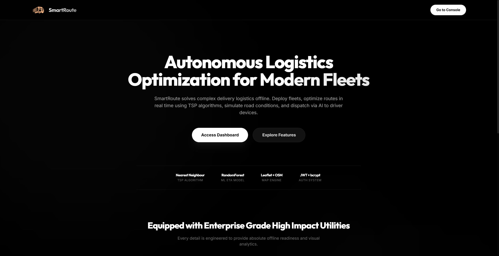
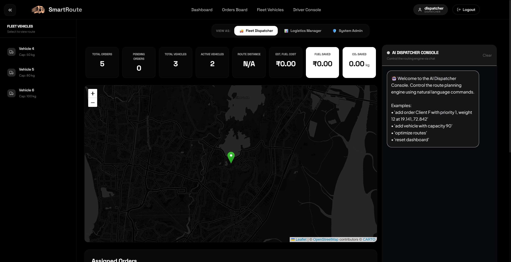
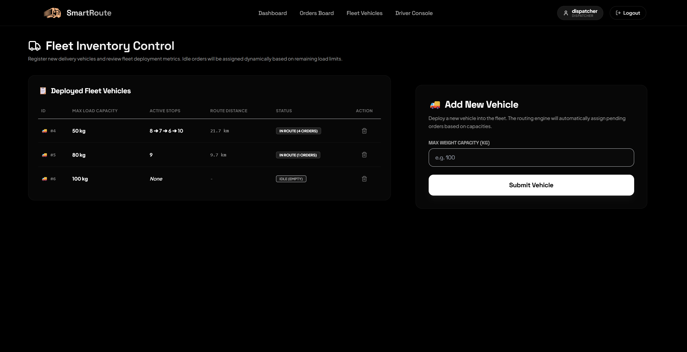
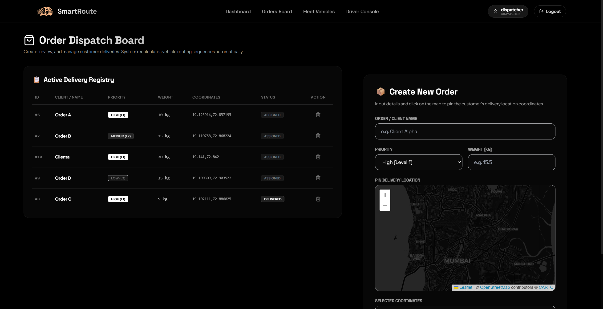

# SmartRoute 🚚💨

### Autonomous Logistics Optimization & Predictive Fleet Dispatch Engine

SmartRoute is an enterprise-grade, offline-first logistics coordination platform designed to streamline fleet operations. It uses Traveling Salesman Problem (TSP) routing algorithms, machine learning models for ETA prediction, and a multi-agent AI framework to simulate and recover from vehicle breakdowns. 

The application features a sleek, minimalist, high-end monochrome dark interface utilizing **Outfit** for headers and **Inter** for body text.

---

## 🎨 Sleek Dark Aesthetics

* **Glassmorphic UI:** Built with dark theme aesthetics, semi-transparent frosted cards, and subtle glowing borders (`border-white/10` to `border-white/30`).
* **Clean Typography:** Fully integrated with custom font scales using **Outfit** (editorial, modern display font) and **Inter** (highly legible geometric body font).
* **Zero Clutter:** Free from generic "hackathon-grade" templates, featuring fine micro-animations and smooth layout transitions.

---

## 🚀 Key Features

### 1. 🤖 AI Chat Dispatcher
Input natural language instructions to manage the fleet. The offline natural language parser processes prompts like *"add order Mumbai with weight 15"* or *"deploy truck 2"* to perform instant database operations and trigger recalculations.

### 2. 🌀 TSP Routing Engine
Uses nearest-neighbor and shortest-path heuristics to optimize stop sequences for multi-stop delivery routes, bypassing arbitrary stops to minimize travel distance.

### 3. 🚨 Autonomous Disruption & Recovery (Multi-Agent Loop)
Simulates vehicle breakdowns. When a truck goes offline, an autonomous agent loop initiates:
* **TelemetryAgent:** Detects the engine/coolant issue.
* **DiagnosticAgent:** Safe-checks and shuts down the vehicle.
* **InventoryAgent:** Identifies stranded shipments.
* **Orchestrator & Solver Agents:** Automatically re-solves TSP paths and routes stranded orders to active vehicles in real-time.

### 4. 📈 Carbon & Cost Analytics
Calculates and displays real-time performance metrics:
* **Absolute Fuel Savings:** Cost difference between TSP optimized route and unoptimized sequential stops.
* **Carbon Reduction:** Metric tons of $CO_2$ saved per route compared to default baseline deliveries.

### 5. 🗺️ Dark CartoDB Mapping
Interactive route plotting powered by **Leaflet.js** and **OpenStreetMap** using CartoDB Dark Matter tiles. Visually displays path directions, stop sequences, and waypoint pins with zero API key dependencies.

### 6. 💬 WhatsApp Driver Dispatch
Export stop sequences and navigation parameters directly to drivers. A single click pre-formats the optimized stops into a dispatch message that can be opened in the WhatsApp mobile app.

### 7. 🛡️ Role-Based Access Control
Includes structured user roles: **Dispatcher**, **Manager**, and **Admin** secured with **JWT tokens** and **bcrypt** password hashing. A built-in role switcher bar allows easy demonstration of dashboard permissions.

---

## 📸 Screenshots

### Elegant Landing Page


### Fleet Dispatcher Console


### Vehicles Management


### Order Dispatching


---

## 🛠️ Technology Stack

* **Frontend:** React, TailwindCSS, Leaflet.js, React-Router-DOM
* **Backend:** FastAPI, Python, SQLAlchemy, JWT, Bcrypt
* **Machine Learning:** Scikit-learn (RandomForest Regressor for ETA overrides), Pandas, NumPy
* **Database:** SQLite (Default zero-setup), PostgreSQL / Supabase supported
* **Deployment:** Docker, Docker Compose, Railway

---

## 🔧 Local Setup & Installation

### Prerequisites
* Python 3.10+
* Node.js 18+
* npm

### Option A: Standard Manual Installation

#### 1. Backend Setup
1. Navigate to the server folder:
   ```bash
   cd server
   ```
2. Create and activate a virtual environment:
   ```bash
   python -m venv venv
   source venv/bin/activate  # On Windows: .\venv\Scripts\activate
   ```
3. Install dependencies:
   ```bash
   pip install -r requirements.txt
   ```
4. Create a `.env` file inside the `server/` directory:
   ```env
   DATABASE_URL=sqlite:///./smartroute.db
   SECRET_KEY=SMARTROUTE_SUPER_SECRET_KEY
   ```
5. Run the FastAPI server:
   ```bash
   uvicorn main:app --reload --port 8000
   ```

#### 2. Frontend Setup
1. Navigate to the client folder:
   ```bash
   cd ../client
   ```
2. Install npm packages:
   ```bash
   npm install
   ```
3. Run the development server:
   ```bash
   npm run dev
   ```
4. Access the web app at `http://localhost:5173`.

---

### Option B: Docker Compose (All-in-One)
Launch the entire stack (FastAPI server + React SPA) with a single command from the project root:
```bash
docker-compose up --build
```
* **Frontend:** `http://localhost:3000`
* **Backend API Docs:** `http://localhost:8000/docs`

---

## 📦 Production Builds (Railway Serving)
The backend python server is configured to serve static frontend files out of its `dist` folder. To compile the frontend for production serving:
1. Navigate to `client/` and build:
   ```bash
   npm run build
   ```
2. Copy the contents of `client/dist/` into `server/dist/`.
3. Commit and push. The FastAPI backend will serve the client SPA at root `/` and support dynamic routing fallback.
